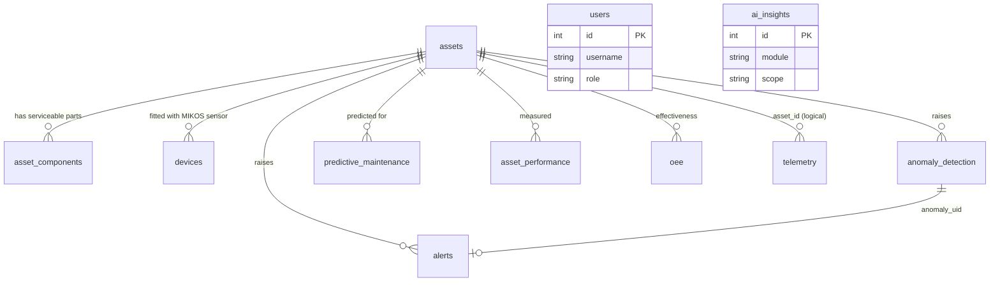
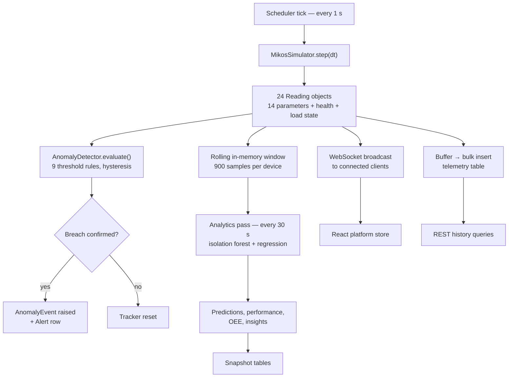
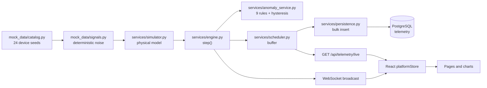
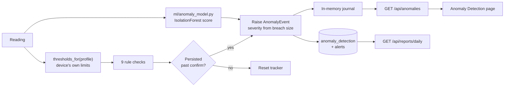
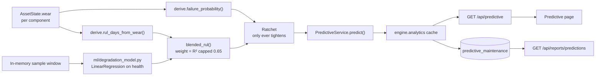
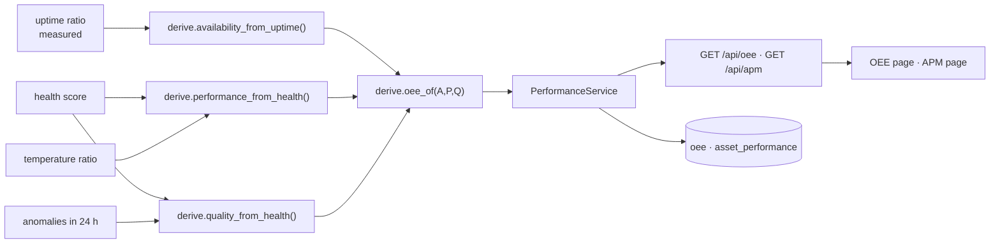
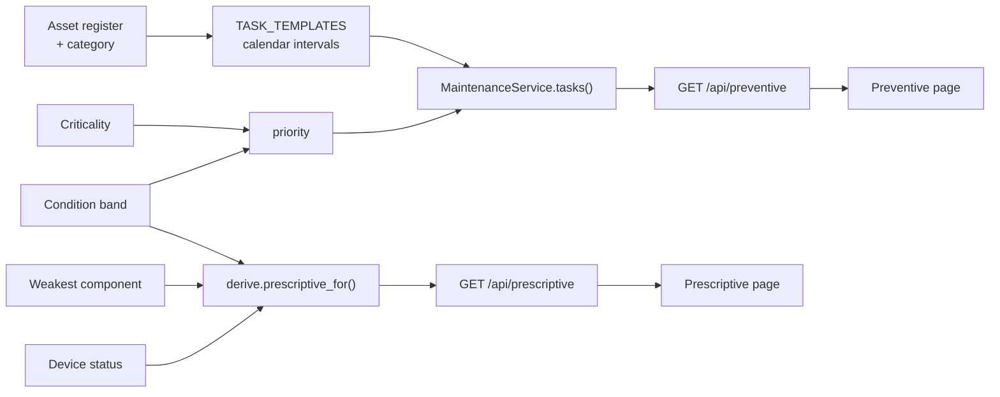
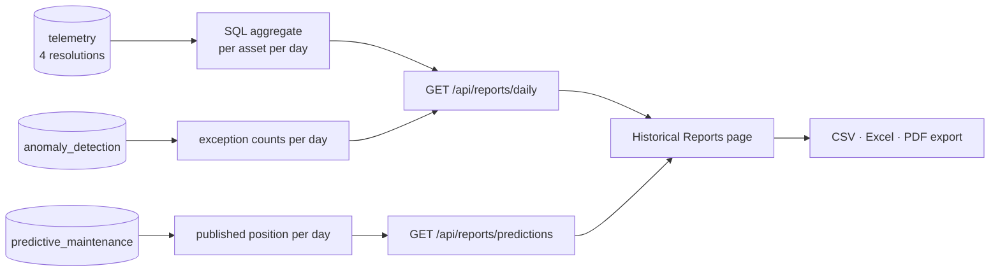
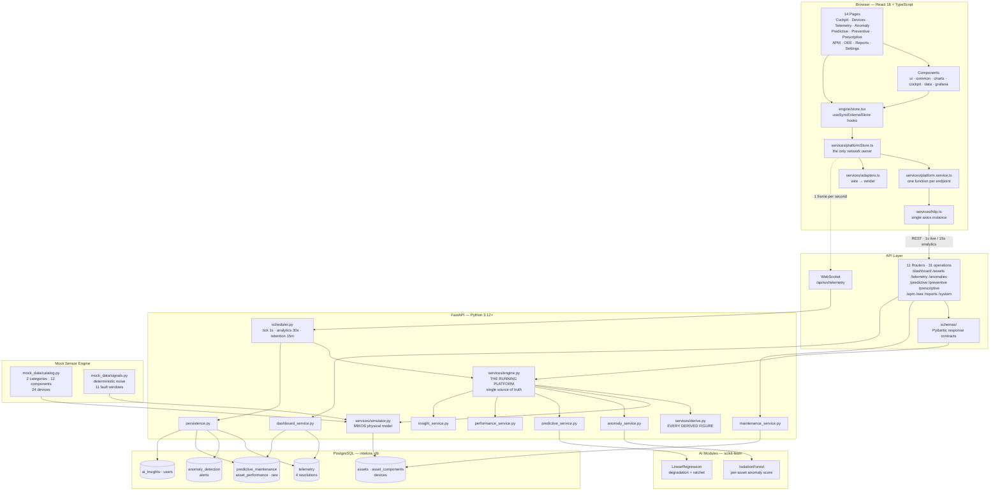
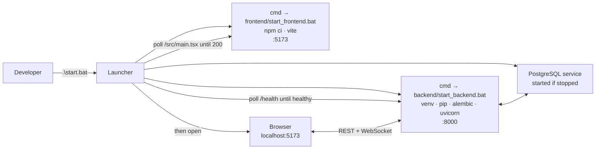

# INTELORA — Project Technical Analysis

**Enterprise AIoT Intelligence Platform**
Read-only technical audit · Prepared 1 August 2026

| | |
|---|---|
| **Repository** | `https://github.com/bhuvi-develop/INTELORA_PROJECT` |
| **Trunk** | `main` · integration `develop` · four `feature/*` branches |
| **Audit commit** | `e5eb6fd` — 214 tracked files, 37,104 lines |
| **Audit scope** | Complete codebase: frontend, backend, database, simulator, AI modules |
| **Audit type** | Read-only. No source file was modified, renamed, deleted or reformatted. |

---

## Table of contents

1. [Executive Summary](#1-executive-summary)
2. [Project Structure](#2-project-structure)
3. [Frontend Analysis](#3-frontend-analysis)
4. [Backend Analysis](#4-backend-analysis)
5. [Database Analysis](#5-database-analysis)
6. [Mock Data Engine Analysis](#6-mock-data-engine-analysis)
7. [Data Source Analysis](#7-data-source-analysis)
8. [Predictive Maintenance Analysis](#8-predictive-maintenance-analysis)
9. [Backend Data Flow](#9-backend-data-flow)
10. [API Documentation](#10-api-documentation)
11. [Python Services](#11-python-services)
12. [React Services](#12-react-services)
13. [Current Simulator](#13-current-simulator)
14. [Live Telemetry](#14-live-telemetry)
15. [Historical Data](#15-historical-data)
16. [AI Modules](#16-ai-modules)
17. [Current Limitations](#17-current-limitations)
18. [Completion Status](#18-completion-status)
19. [Future Work](#19-future-work)
20. [Final Architecture Diagram](#20-final-architecture-diagram)

---

## 1. Executive Summary

### 1.1 What INTELORA is

INTELORA is a full-stack industrial IoT intelligence platform for monitoring a commissioned
estate of IT and electronics assets. It presents itself as an enterprise operations product in
the class of IBM Maximo, Siemens Insights Hub or GE Digital APM: an executive cockpit, live
telemetry, anomaly detection, four maintenance disciplines, asset performance management,
overall equipment effectiveness and historical reporting.

The estate is **24 devices — 14 laptops and 10 mobile chargers** — each fitted with a simulated
**MIKOS Smart Energy Sensor** publishing fourteen electrical and thermal parameters once per
second.

### 1.2 Current status

**The platform is operational end to end.** A developer can clone the repository, run one
command, and reach a working system with thirty days of history already in the database.

```
.\start.bat     →  toolchain checks, venv, PostgreSQL, migrations,
                   FastAPI + sensor engine, Vite, browser
.\stop.bat      →  graceful shutdown, ports released
.\restart.bat   →  stop, settle, start
```

### 1.3 Architecture in one paragraph

A **Python FastAPI backend** owns everything that carries meaning. It runs a physically-modelled
sensor simulation, stores every reading in **PostgreSQL**, and computes every domain figure —
health score, anomaly severity, failure probability, remaining useful life, maintenance priority,
criticality, availability, performance, quality and OEE — in Python. A **React 18 + TypeScript**
frontend renders those figures and computes none of them. The two are joined by a REST surface
of 31 operations plus a websocket live feed, consumed through a single client-side store.

### 1.4 Development progress

| Layer | Status | Evidence |
|---|---|---|
| Backend service | **Complete** | 57 Python files, 9,391 lines, 47 passing tests |
| Sensor simulation | **Complete** | Physical model, deterministic, invariant-tested |
| Database | **Complete** | 11 tables, Alembic migration `32b436e381e2`, 67k+ rows |
| REST + WebSocket API | **Complete** | 31 HTTP operations + `/api/ws/telemetry` |
| Business logic | **Complete** | Entirely in `app/services/derive.py` and siblings |
| AI / ML | **Complete for scope** | Isolation forest + degradation regression, with fallbacks |
| Frontend rendering | **Complete** | 84 `.tsx` files, 13 routes, dark + light themes |
| Frontend data layer | **Complete** | Migrated from a browser simulator to the FastAPI API |
| Startup automation | **Complete** | 7 batch files, tested across repeated cold cycles |
| Authentication | **Deliberately bypassed** | `BYPASS = true` in `AuthProvider.tsx` |
| Grafana embedding | **Built, not provisioned** | Component ships an offline fallback; no instance configured |
| Frontend test suite | **Missing** | 0 tests under `src/` |
| CI/CD | **Missing** | No workflow files |

### 1.5 Modules by completeness

**Complete and serving live backend data (10):**
Enterprise Cockpit · Devices register · Device detail · Live Telemetry · Anomaly Detection ·
Predictive Maintenance · Preventive Maintenance · Prescriptive Maintenance · Asset Performance
Management · Overall Equipment Effectiveness · Historical Reports · Settings

**Partially complete (3):**

| Module | What works | What does not |
|---|---|---|
| **Grafana panels** | Component, URL builder, variables, graceful offline card | No Grafana instance configured, so every panel renders the fallback |
| **Authentication** | Provider, token store, protected-route wrapper, seeded users | Bypassed by design; `users` table is written but no endpoint reads it |
| **Preventive sign-off** | Complete/reopen endpoints, priority, overdue tracking | Completion state is in-memory only and does not survive a restart |

**Missing (3):**
Frontend automated tests · CI pipeline · Alert ownership and escalation workflow
(the `alerts` table is populated but no endpoint exposes its lifecycle independently).

### 1.6 Headline engineering property

The platform's central promise is that **no two screens disagree about the same device**. This is
structural, not a convention: component wear is the only mutable state in the simulation, and
health, remaining life, failure probability, performance, quality and OEE are all pure functions
of it computed in one module. `backend/tests/test_consistency.py` proves it by ageing the estate
and asserting that every dependent figure moved in the direction it must.

---

## 2. Project Structure

### 2.1 Top level

```
INTELORA/
├── start.bat                   One-click startup: checks, DB, backend, frontend, browser
├── stop.bat                    Graceful shutdown of every service, ports released
├── restart.bat                 stop → settle → start
├── .gitattributes              Pins *.bat to CRLF so a clone runs on Windows
├── .env.example                Frontend environment template  ⚠ stale — see §17
│
├── index.html                  Vite entry document
├── package.json                Frontend dependencies and scripts
├── vite.config.ts              Build config, path alias, dependency pre-bundling
├── tsconfig.json               Strict TypeScript configuration
├── tailwind.config.js          Design tokens backed by CSS custom properties
├── eslint.config.js            Lint rules
│
├── frontend/                   Frontend launchers only  (see note below)
│   ├── start_frontend.bat
│   └── stop_frontend.bat
│
├── src/                        The React application  (132 files)
└── backend/                    The Python service     (66 files)
```

> **Note on `frontend/`.** The React application lives at the repository root, not inside
> `frontend/`. That folder contains only the two launcher scripts, which resolve the application
> root relatively (`%~dp0..`). This was a deliberate decision to satisfy the requested launcher
> layout without relocating a working application. It is a divergence from the conventional
> two-folder monorepo shape and is recorded in §17.

### 2.2 Backend structure

```
backend/
├── main.py                     FastAPI app, lifespan orchestration, /health
├── requirements.txt            13 pinned-minimum dependencies
├── alembic.ini                 Migration config (URL injected from app settings)
├── alembic/
│   ├── env.py                  Reads the app's own URL and metadata
│   └── versions/
│       └── 32b436e381e2_initial_schema.py
├── start_backend.bat           Service launcher
├── stop_backend.bat            Graceful service shutdown
├── logs/                       Rotating application log
├── tests/                      47 tests across four files
│
└── app/
    ├── config.py               Every tunable, sourced from the environment
    ├── logging_config.py       Rotating file + console handlers
    │
    ├── database/               Persistence infrastructure
    │   ├── base.py             Engine, session factory, declarative base
    │   ├── init_db.py          CREATE DATABASE, schema, asset seeding
    │   └── backfill.py         Thirty-day history generation
    │
    ├── models/                 SQLAlchemy ORM — 11 tables
    │   ├── asset.py            Asset, AssetComponent, Device
    │   ├── telemetry.py        Telemetry
    │   ├── anomaly.py          AnomalyDetection, Alert
    │   ├── maintenance.py      PredictiveMaintenance, AssetPerformance, Oee, AiInsight
    │   └── user.py             User
    │
    ├── schemas/                Pydantic response contracts
    │   ├── common.py           Shared primitives, literal unions, Meta envelope
    │   ├── telemetry.py        The fourteen MIKOS parameters
    │   ├── asset.py            Asset identity, detail, components
    │   └── analysis.py         Anomaly, predictive, APM, OEE, dashboard payloads
    │
    ├── mock_data/              The simulated estate
    │   ├── catalog.py          Categories, components, profiles, 24 device seeds
    │   └── signals.py          Deterministic noise, OU process, fault injection
    │
    ├── services/               Domain logic — the heart of the platform
    │   ├── simulator.py        MIKOS sensor physical model
    │   ├── derive.py           Every derived figure, computed once
    │   ├── engine.py           The running platform, single source of truth
    │   ├── anomaly_service.py  Threshold detection with hysteresis
    │   ├── predictive_service.py   Failure probability and remaining life
    │   ├── performance_service.py  Availability, performance, quality, OEE
    │   ├── maintenance_service.py  Preventive schedule, prescriptive actions
    │   ├── insight_service.py  AI narrative generation
    │   ├── dashboard_service.py    Energy, prior-day baseline, activity, trail
    │   ├── persistence.py      Writing platform state into PostgreSQL
    │   └── scheduler.py        Background tasks, websocket fan-out
    │
    ├── ml/                     Machine learning
    │   ├── anomaly_model.py    Per-asset isolation forest
    │   ├── degradation_model.py    Health regression, blending, ratchet
    │   └── features.py         Shared feature extraction
    │
    └── routers/                HTTP surface — 31 operations
        ├── dashboard.py  assets.py  telemetry.py  anomalies.py
        ├── predictive.py maintenance.py  apm.py  oee.py
        ├── reports.py    system.py  deps.py
```

### 2.3 Frontend structure

```
src/
├── main.tsx                    React root
├── App.tsx                     Providers, router, error boundary
│
├── routes/                     13 routes, path constants, protected wrapper
├── pages/                      14 page components
├── config/
│   ├── env.ts                  Runtime configuration from import.meta.env
│   ├── navigation.ts           Sidebar sections and module titles
│   └── viz.ts                  Validated chart palettes, dark and light
│
├── services/                   ← THE DATA LAYER
│   ├── http.ts                 The single axios instance, error normalisation
│   ├── platform.service.ts     One function per backend endpoint
│   ├── adapters.ts             Wire format → render format
│   ├── platformStore.ts        Polling, websocket, snapshot assembly
│   ├── auth.service.ts         Login/refresh (inert while auth is bypassed)
│   └── directory.ts            Demo credential directory
│
├── engine/                     ← VOCABULARY ONLY (was the browser simulator)
│   ├── types.ts                Domain model
│   ├── derive.ts               Colours, labels, orderings, backend-fed thresholds
│   ├── analytics.ts            Chart view models over delivered records
│   ├── catalog.ts              Channel display metadata, fleet facets
│   ├── platform.ts             Service state tone map
│   └── store.tsx               React binding — hooks over the platform store
│
├── components/
│   ├── ui/          14 primitives   (Button, Card, Modal, Select, Table chrome…)
│   ├── common/      12 shared       (StatTile, HealthMeter, ConnectionBanner…)
│   ├── charts/      16 visualisations
│   ├── cockpit/      9 executive panels
│   ├── data/         3 table components
│   ├── grafana/      3 embedding components
│   ├── layout/       4 shell components
│   └── ai/           1 AI insight panel
│
├── context/                    Theme, Auth, Toast, UI providers
├── hooks/                      10 UI hooks + re-exported store hooks
├── lib/                        axios shim, class merge, query client, token store
├── types/
│   ├── api.ts                  FastAPI response contracts (snake_case)
│   └── index.ts                Shared UI types
├── utils/                      Formatting, CSV/Excel/PDF export
└── styles/index.css            Two complete theme blocks
```

### 2.4 Folder responsibilities

| Folder | Owns | Must never |
|---|---|---|
| `backend/app/mock_data` | The simulated estate and its deterministic signals | Contain business rules |
| `backend/app/services` | Every domain calculation and the running platform | Contain HTTP concerns |
| `backend/app/routers` | Request shaping, filtering, status codes | Contain domain calculations |
| `backend/app/models` | Table definitions and relationships | Contain query logic |
| `backend/app/schemas` | The published contract | Contain defaults that mask missing data |
| `src/services` | Every conversation with the network | Contain rendering |
| `src/engine` | Display vocabulary and chart view models | Compute a domain figure |
| `src/components` | Rendering only | Know that a network exists |

---

## 3. Frontend Analysis

### 3.1 Stack

React 18.3 · TypeScript 5.6 (strict, `noUnusedLocals`, `noUnusedParameters`,
`noImplicitOverride`) · Vite 5 · Tailwind CSS 3.4 · React Router 6 · Framer Motion ·
Recharts · TanStack Table v8 · TanStack Query · Axios · Lucide icons · jsPDF.

### 3.2 Architecture

The application is organised in four strict layers:

```
Pages and components        render only
        ↑
src/engine/store.tsx        React binding — useSyncExternalStore hooks
        ↑
src/services/platformStore  one object that owns all network state
        ↑
src/services/*.service      one function per backend endpoint
        ↑
src/services/http.ts        the single axios instance
```

**No component builds a request.** A grep across `src/` finds `axios`, `fetch(` or
`new WebSocket` in exactly six files, all under `src/services` and `src/lib`. Every page reads
data through hooks.

### 3.3 State management

There is no Redux, Zustand or Context-based data store. State is an **external store read through
`useSyncExternalStore`**, which guarantees every subscriber sees the same snapshot with no
tearing — important when twenty panels render one estate at one instant.

The selector layer caches against snapshot identity: a component subscribing to one slice does
not re-render when an unrelated slice changes, and a slice that is deep-equal across ticks keeps
its previous reference so React can skip the render entirely.

**Hooks exposed** (`src/engine/store.tsx`):

| Hook | Returns |
|---|---|
| `useSnapshot()` | The whole platform snapshot |
| `useFleetKpis()` | KPI block |
| `useFleetOee()` | Fleet effectiveness |
| `useAssetList()` | Every asset with condition |
| `useAssetRuntime(id)` | One asset, and registers interest so its detail is fetched |
| `useAnomalyJournal()` | The anomaly journal |
| `usePreventiveTasks()` | The maintenance schedule |
| `useCategoryRollups()` | Per-class aggregates |
| `useFleetTrail()` | Rolling estate trend |
| `useEngineControl()` | Actions: acknowledge, complete task, reopen, refresh |
| `useDailyRecords()` / `usePredictionRecords()` | Report archives |
| `useConnection()` | Connection status, transport, retry |

### 3.4 Routing

Thirteen routes. `/` is the branding screen, which auto-navigates to the cockpit after 1.2 s.
Everything else lives under `/app` inside the shell.

| Path | Page |
|---|---|
| `/` | Branding screen |
| `/login` | Redirect to cockpit (auth bypassed) |
| `/app/cockpit` | Enterprise Cockpit |
| `/app/overview` | Legacy redirect to cockpit |
| `/app/devices` | Device register |
| `/app/devices/:assetId` | Device detail |
| `/app/live-telemetry` | Live Telemetry |
| `/app/anomaly-detection` | Anomaly Detection |
| `/app/predictive-maintenance` | Predictive Maintenance |
| `/app/preventive-maintenance` | Preventive Maintenance |
| `/app/prescriptive-maintenance` | Prescriptive Maintenance |
| `/app/asset-performance` | Asset Performance Management |
| `/app/oee` | Overall Equipment Effectiveness |
| `/app/historical-reports` | Historical Reports |
| `/app/settings` | Settings |
| `*` | Not found |

### 3.5 Charts and tables

Sixteen chart components wrap Recharts behind a consistent frame (title, eyebrow, legend,
footnote). The palette layer (`src/config/viz.ts`) carries two independently validated
categorical palettes — one for the dark surface, one for the light — swapped in place on theme
change, because Recharts writes colours as SVG presentation attributes where CSS custom
properties do not resolve.

Tables use TanStack Table v8 with column metadata for alignment and numeric formatting, paired
with a shared toolbar and pagination component. Export runs through one column definition that
drives CSV (UTF-8 with BOM), Excel (SpreadsheetML with frozen header and autofilter, no library)
and PDF (lazily-imported jsPDF).

### 3.6 Grafana

`GrafanaPanel` builds a `d-solo` embed URL with dynamic dashboard, panel id and `var-*`
template variables, and renders a graceful offline card when `VITE_GRAFANA_BASE_URL` is unset —
which it currently is. The integration is complete in code and unprovisioned in practice.

### 3.7 Where the frontend gets its data

**Entirely from FastAPI.** The platform store runs two cadences:

- **Live, every second** — `/api/telemetry/live`, or a websocket frame from
  `/api/ws/telemetry` when available. Each reading updates that device's rolling window, its
  live sample, its health score and its connectivity status.
- **Analytics, every fifteen seconds** — six requests issued in parallel and aborted if
  superseded: `/api/dashboard`, `/api/assets`, `/api/anomalies`, `/api/preventive`,
  `/api/predictive`, `/api/prescriptive`.

On first connect the store additionally hydrates each device's chart history from
`/api/telemetry/live/{id}/window`, loads the report archives once, and reads
`/api/system/status` to learn the platform's real sensor cadence and degradation clock.

### 3.8 Does the frontend still contain mock data?

**No.** Verified by inspection at the audit commit:

| Check | Result |
|---|---|
| `Math.random`, `faker`, `mockData`, `fakeData`, `seedData`, `dummyData`, `sampleData`, `mockTelemetry` in `src/` | **0 occurrences** |
| Imports of `engine/simulator`, `engine/noise`, `engine/rootCause`, `engine/patterns`, `mockGateway` | **0 occurrences** |
| Files deleted in the migration | `simulator.ts`, `noise.ts`, `rootCause.ts`, `patterns.ts`, `mockGateway.ts`, `utils/random.ts` |
| `src/engine` today | 1,337 lines of types, vocabulary and chart view models — no generation |

### 3.9 Does the frontend calculate business logic?

**Not for any published metric.** Health, band, risk tier, failure probability, remaining life,
maintenance priority, criticality, availability, performance, quality, OEE, MTBF, MTTR, energy
intelligence and every AI narrative arrive computed. The frontend renames fields and formats
numbers.

Three residues remain and are recorded honestly:

| Location | What it does | Assessment |
|---|---|---|
| `ApmPage`, `OeePage`, `PredictiveMaintenancePage`, `CockpitPage` | Averages **already-published** per-asset figures across an operator-selected filter | Display aggregation, not re-derivation. Remove the filter and it reproduces the server's own numbers. Still arithmetic in React — see §17. |
| `analytics.ts → effectivenessLosses` | Applies the loss cascade to a filtered subset | The backend publishes this cascade for the whole estate on `/api/oee`; this renders the same decomposition for an arbitrary selection |
| `analytics.ts → projectDegradation` | Draws a decay curve between today's health and the published remaining life | A rendering of two backend figures, not a prediction. No model of its own. |

---

## 4. Backend Analysis

### 4.1 FastAPI architecture

`main.py` defines the application, CORS, a timing middleware that stamps `X-Process-Time-Ms` on
every response, a global exception handler that never leaks a traceback, and a **lifespan
handler that is the entire operational sequence**:

1. `ensure_database()` — creates `intelora_db` if the server does not have it
2. `create_tables()` — ensures the schema
3. `initialise()` — seeds the asset register, its components, its sensors and two users
4. `restore_component_wear()` — resumes the estate's real age from PostgreSQL
5. Back-fill thirty days of history if none is stored, otherwise restore the cumulative meters
6. Fit both ML models and run a first analytics pass
7. Start the background scheduler — the sensor engine begins publishing

No manual trigger, no separate worker process, no external scheduler.

### 4.2 Routers

Eleven router modules, mounted under `/api`. Routers contain no domain calculation: they filter,
shape, page and set status codes.

| Router | Prefix | Operations |
|---|---|---|
| `dashboard.py` | `/dashboard` | 2 |
| `assets.py` | `/assets` | 3 |
| `telemetry.py` | `/telemetry` | 4 |
| `anomalies.py` | `/anomalies` | 5 |
| `predictive.py` | `/predictive` | 2 |
| `maintenance.py` | `/preventive`, `/prescriptive` | 4 |
| `apm.py` | `/apm` | 2 |
| `oee.py` | `/oee` | 2 |
| `reports.py` | `/reports` | 3 |
| `system.py` | `/system`, `/ws` | 2 + websocket |
| `deps.py` | — | Shared `build_meta` dependency |

Every response carries a `meta` block with `generated_at`, `tick` and `analytics_tick`. Two
responses with the same tick were computed from the same estate state — which is how a caller
can tell whether two panels are showing the same instant.

### 4.3 Services

| Service | Responsibility |
|---|---|
| `simulator.py` | The MIKOS physical model — state machine, electrical relationships, thermal mass, wear accrual |
| `derive.py` | Every derived figure: bands, health, RUL, failure probability, priority, risk, OEE, anomaly severity, prescriptive rules |
| `engine.py` | The running platform. Owns the simulator, detector, models and cached analytics. Every router reads this one instance. |
| `anomaly_service.py` | Threshold rules with confirm/clear hysteresis, plus model corroboration |
| `predictive_service.py` | Per-component predictions, blending and ratcheting |
| `performance_service.py` | Availability, performance, quality, OEE, ranking, category rollups |
| `maintenance_service.py` | Preventive schedule and prescriptive actions |
| `insight_service.py` | AI narratives assembled from computed figures |
| `dashboard_service.py` | Energy intelligence, prior-day baseline, activity journal, fleet trail |
| `persistence.py` | Bulk writes, state restore, retention pruning |
| `scheduler.py` | Three background loops and websocket fan-out |

### 4.4 Background tasks

| Loop | Interval | Work |
|---|---|---|
| **tick** | 1 s | Advance the estate, judge every reading, buffer and store it, push to websockets |
| **analytics** | 30 s | Refit both models, recompute predictions and effectiveness, write snapshots and insights |
| **retention** | 15 min | Prune raw telemetry past the window, bound the snapshot tables |

Database work runs in a worker thread so the synchronous SQLAlchemy session never blocks the
event loop. The tick loop schedules against a **fixed origin** rather than sleeping a fixed
interval, so a slow write does not push every later tick further behind; if it falls more than
five intervals behind, the schedule is re-based rather than replaying a backlog of seconds that
never happened.

### 4.5 The business layer

`app/services/derive.py` is the single place where a health-dependent number is computed:

| Figure | Rule |
|---|---|
| Asset wear | `worst × 0.62 + mean × 0.38` — one failing part drags the asset down without five healthy parts masking it |
| Health score | `100 − 82 · wear^1.18 − transient penalty` — convex, so the last twenty wear points cost far more than the first |
| Condition bands | 95+ Healthy · 80–94 Good · 65–79 Warning · below 65 Critical |
| Remaining useful life | Distance to the failure boundary over the component's own smoothed wear rate |
| Failure probability | Logistic on projected wear inside a 30-day horizon |
| Maintenance priority | Probability and remaining life, weighted by business criticality (High ×1.35, Medium ×1.0, Low ×0.75) |
| Availability | Measured uptime — not a function of health |
| Performance | Condition against nominal capability, throttled above 85% of the thermal ceiling |
| Quality | First-pass success degraded by condition and recent anomaly load |
| OEE | `A × P × Q`, with a loss cascade that sums to the real gap |
| Risk tier | Condition, projected probability and open critical alarms. An offline device is never rated better than medium — unknown is not the same as good. |
| Operational health | `0.62·condition + 0.26·availability + 0.12·coverage − alarm penalty` |

---

## 5. Database Analysis

### 5.1 Database

**`intelora_db`** on PostgreSQL 14+ (verified against PostgreSQL 18). Created automatically on
first start. Connection via `psycopg` 3 through SQLAlchemy 2.0 with a pooled engine
(`pool_size=10`, `max_overflow=20`, `pool_pre_ping=True`).

### 5.2 Tables — eleven

| Table | Columns | Purpose |
|---|---|---|
| `users` | 9 | Platform accounts — seeded, not yet consumed by any endpoint |
| `assets` | 15 | The asset register: the six displayed fields plus engineering ratings |
| `asset_components` | 9 | Serviceable parts and their accumulated wear |
| `devices` | 12 | MIKOS sensors bound to assets: serial, firmware, gateway, relay |
| `telemetry` | 21 | Every reading at every resolution |
| `anomaly_detection` | 22 | What broke, by how much, with what score |
| `alerts` | 15 | Alert lifecycle: ownership, response target, acknowledgement |
| `predictive_maintenance` | 13 | Per-component prediction snapshots |
| `asset_performance` | 16 | Availability, performance, quality, MTBF, MTTR |
| `oee` | 13 | Effectiveness snapshots, per asset and for the fleet |
| `ai_insights` | 11 | Generated narratives, per module |

> `asset_components` is not one of the ten originally specified tables. It exists because wear
> must live somewhere addressable for per-component queries to be answerable, and folding six
> mutable floats into the register would put engineering state into the table the interface reads
> for identity.

### 5.3 Relationships



Seven tables carry a foreign key to `assets.asset_id` with `ON DELETE CASCADE`. `telemetry` is
joined logically rather than by constraint — deliberately, because it is the highest-volume table
and a foreign key check on every bulk insert would cost throughput for a guarantee the writer
already provides.

### 5.4 Indexes

Thirty-one indexes. The ones that matter:

| Index | Table | Serves |
|---|---|---|
| `ix_telemetry_asset_ts` | telemetry | One asset, one time range — the shape of every history query |
| `ix_telemetry_resolution_ts` | telemetry | Resolution-scoped range scans and retention pruning |
| `ix_anomaly_asset_detected` | anomaly_detection | Per-asset journals and daily report counts |
| `ix_predictive_asset_component` | predictive_maintenance | Component history |
| `ix_performance_asset_computed` | asset_performance | Performance trend per asset |

### 5.5 Storage strategy

| Data | Written | Retained |
|---|---|---|
| Live telemetry | One bulk insert per tick (24 rows/second) | 24 hours at second resolution, then pruned |
| Historical telemetry | Generated once on first start | Never pruned |
| Anomalies + alerts | On raise; updated on acknowledge/resolve | Bounded in memory at 5,000; unbounded in PostgreSQL |
| Predictions | 144 rows per analytics pass | 30 days |
| Performance / OEE | 24 + 25 rows per pass | 30 days |
| AI insights | 4 rows per pass | 30 days |

---

## 6. Mock Data Engine Analysis

### 6.1 Where mock data originates

**Exclusively in the backend.** Three files:

| File | Role |
|---|---|
| `backend/app/mock_data/catalog.py` | The commissioned estate: two categories, twelve component specifications, two operating-mode state machines, 24 device seeds |
| `backend/app/mock_data/signals.py` | Deterministic noise, the Ornstein–Uhlenbeck step, first-order lag, and eleven scheduled fault windows |
| `backend/app/services/simulator.py` | The physical model that turns those into readings |

There is no mock data in the frontend, and no second generator anywhere.

### 6.2 Is the data random or simulated?

**Simulated, and deterministic.** `signals.py` contains no call to `random`. Every value is a
pure function of `(key, index)` computed through an FNV-style string hash and an integer mixing
function. The same second of simulated time always produces the same reading.

That property is what makes the thirty days of stored history and the live stream **one
continuous series** rather than two unrelated datasets — the back-fill is the same model run
forward from a month ago.

### 6.3 How the simulator works internally

Each device holds an `AssetState`. One `step(dt)` advances it:

```
1  Excursion check      Is a scheduled fault window active at this instant?
2  Link loss            If so and it is a link fault: publish nothing, cool toward ambient
3  Operating mode       Dwell expired? Pick the next mode from its transition weights
4  Demand               target = rated × load_factor × (1 + slow wander)
5  Power lag            demand approaches target through a first-order lag (τ 5–9 s)
6  Power factor         approaches the mode's PF, degraded by conversion-stage wear (τ 18 s)
7  Voltage              nominal − (impedance × current) + drift + sensor noise, floored at 55%
8  Current              I = demand / (V · PF), then any current excursion, then hard-limited
9  Published power      P = V · I · PF     ← recomputed so the set is internally consistent
10 Triangle             S = V · I ;  Q = √(S² − P²)
11 Frequency            OU process around nominal, clamped ±1.2 Hz
12 Accumulators         energy += P/1000 · dt/3600 ;  runtime += dt/3600
13 Temperature          thermal mass approaches ambient + rise × load × (1 + cooling wear)
14 Relay                Open when offline; count re-energisations on make
15 Wear                 each component ages by thermal, load and cycle stress × duty
16 Health               health = f(wear) less any live thermal or over-current penalty
```

**Why the ordering matters.** Current is drawn from the *smoothed demand*, never from the
previous tick's published power. An earlier revision derived current from a power value that had
itself been derived from current, which closed a positive feedback loop between voltage sag and
draw — during a cable-fault window it reached **384 A through a 65 W laptop adapter**. The
separation of `demand_power` from `active_power`, plus a supply floor and a current limit, is
what makes the model physical rather than merely plausible.

### 6.4 Realistic behaviour falls out of the model

The specified narratives are not scripted; they are what the equations do.

**A laptop begins charging** — the mode changes, so demand rises, so current climbs, so power
climbs, so the thermal target rises and temperature follows it over the next several minutes
(τ = 210 s), so energy accumulates faster, so wear accrues faster, so health drifts down.

**A laptop goes idle** — demand falls, current and power fall with it, the thermal target drops
and the device cools gradually rather than instantly, and energy accumulation slows.

**A charger under heavy load** — current and power rise, temperature climbs on the charger's much
shorter thermal time constant (τ = 110 s), voltage sags slightly under the extra draw, and the
power factor moves with load exactly as a switch-mode supply's does: about **0.48 at no load,
about 0.95 loaded**.

### 6.5 Update frequency

| Context | Interval | Wear clock |
|---|---|---|
| Live stream | 1 second | ×60 — one second of watching ages the estate by one minute |
| History back-fill (hourly band) | 3,600 s | ×1 — true rate |
| History back-fill (quarter band) | 900 s | ×1 |
| History back-fill (minute band) | 60 s | ×1 |

The asymmetry is deliberate and documented: the stored past is the true past at one day per day,
while the live stream runs an accelerated demonstration clock so degradation is observable within
a session. Applying ×60 to a month of history would age the estate by five years and kill it.

### 6.6 Complete lifecycle of one reading



---

## 7. Data Source Analysis

Every module, traced from screen to simulator.

### 7.1 Enterprise Cockpit

```
CockpitPage.tsx
  └ useSnapshot()
      └ platformStore  ── GET /api/dashboard            (every 15 s)
      │                 ── GET /api/telemetry/live       (every 1 s / websocket)
      └ routers/dashboard.py
          ├ engine.live_kpis()          ← in-memory estate, current tick
          ├ engine.analytics            ← cached derived state (30 s cadence)
          ├ dashboard_service.energy_intelligence()   → telemetry table (SQL)
          ├ dashboard_service.yesterday_baseline()    → telemetry + oee tables
          ├ dashboard_service.fleet_trail()           → telemetry + oee tables
          ├ dashboard_service.activity_feed()         ← anomaly journal in memory
          ├ insight_service.build_all()               ← computed figures
          └ engine.platform_health()                  ← scheduler + DB probe
              └ MikosSimulator  ←  mock_data/catalog.py + signals.py
```

### 7.2 Anomaly Detection

```
AnomalyDetectionPage.tsx
  └ useAnomalyJournal() + useSnapshot()
      └ GET /api/anomalies?limit=500
          └ routers/anomalies.py  →  engine.detector.journal   (IN MEMORY)
              └ AnomalyDetector.evaluate() per tick
                  ├ thresholds from mock_data/catalog.py device profile
                  └ anomaly score from ml/anomaly_model.py (IsolationForest)
      Persisted in parallel to  anomaly_detection  and  alerts  tables
      ⚠ The API reads the in-memory journal, not the table — see §17
```

### 7.3 Predictive Maintenance

```
PredictiveMaintenancePage.tsx
  └ useAssetList() + useSnapshot()
      └ GET /api/predictive                     (every 15 s)
          └ routers/predictive.py  →  engine.analytics.predictions
              └ PredictiveService.predict()
                  ├ wear + smoothed wear rate  ← AssetState (simulator)
                  ├ derive.failure_probability()   logistic on projected wear
                  ├ derive.rul_days_from_wear()    analytical projection
                  ├ DegradationModel.blended_rul() LinearRegression on health
                  └ DegradationModel ratchet       published figures only tighten
      Persisted to  predictive_maintenance  every analytics pass
```

### 7.4 Preventive Maintenance

```
PreventiveMaintenancePage.tsx
  └ usePreventiveTasks() + useEngineControl()
      └ GET /api/preventive                     (every 15 s)
      └ POST /api/preventive/{task_id}/complete | /reopen
          └ routers/maintenance.py  →  MaintenanceService.tasks()
              ├ TASK_TEMPLATES per category (calendar intervals)
              ├ due date from last completion or commissioning + stagger
              ├ priority from condition band + days until due + criticality
              └ completion state: IN-MEMORY dict  ⚠ not persisted — see §17
```

### 7.5 Prescriptive Maintenance

```
PrescriptiveMaintenancePage.tsx
  └ useAssetList() + useAnomalyJournal()
      └ GET /api/prescriptive                   (every 15 s)
          └ routers/maintenance.py  →  MaintenanceService.actions()
              └ derive.prescriptive_for(band, weakest component, status, temp ratio)
                  ← band from health ← wear ← simulator
                  ← weakest component from PredictiveService
      No telemetry, no charts, no analytics — by design
```

### 7.6 Asset Performance Management

```
ApmPage.tsx
  └ useAssetList() + useCategoryRollups() + useFleetTrail() + useFleetKpis()
      └ GET /api/apm  (and /api/dashboard for the trail)
          └ routers/apm.py  →  engine.analytics.ranking
              └ PerformanceService.ranking()
                  ├ availability ← measured uptime ratio (simulator)
                  ├ performance  ← derive.performance_from_health()
                  ├ quality      ← derive.quality_from_health()
                  ├ MTBF/MTTR    ← runtime + resolved anomaly durations
                  └ risk tier    ← derive.risk_tier_of()
      Ranking carries no telemetry — deliberately
      Persisted to  asset_performance  every analytics pass
```

### 7.7 Overall Equipment Effectiveness

```
OeePage.tsx
  └ useAssetList() + useSnapshot() + useCategoryRollups()
      └ GET /api/oee  ·  GET /api/oee/losses
          └ routers/oee.py  →  PerformanceService.fleet_oee()
              ├ per-asset OEE = A × P × Q      (derive.oee_of)
              ├ fleet OEE = mean of per-asset OEE
              │   (not the product of three means — those are not the same number)
              └ loss cascade  ← derive.effectiveness_losses()
      Persisted to  oee  table, scope='asset' and scope='fleet'
```

### 7.8 Reports

```
HistoricalReportsPage.tsx
  └ useDailyRecords() + usePredictionRecords() + useAnomalyJournal() + usePreventiveTasks()
      └ GET /api/reports/daily?days=30        (once per session)
      └ GET /api/reports/predictions?days=30  (once per session)
          └ routers/reports.py  →  SQL aggregates over
              ├ telemetry              avg/max/min per asset per day
              ├ anomaly_detection      exception counts per asset per day
              └ predictive_maintenance published position per component per day
      Reproducible: running the same range twice returns the same figures
```

### 7.9 Analytics (cross-cutting)

Analytics is not a page but a capability spread across the modules. Its statistical inputs are:

| Analytic | Computed in | Reaches the screen via |
|---|---|---|
| Anomaly type tallies | Backend `/api/anomalies` `by_type`; frontend also groups the delivered journal for its chart | Anomaly Detection |
| Detection rate over time | Frontend buckets the delivered journal | Anomaly Detection timeline |
| RUL distribution | Backend `/api/predictive` `rul_distribution` | Predictive |
| Component queue | Backend `/api/predictive/queue` | Predictive |
| Effectiveness losses | Backend `/api/oee/losses` | OEE |
| Energy intelligence | Backend `dashboard_service` over the telemetry table | Cockpit |
| Fleet trend | Backend `fleet_trail` over telemetry + oee | Cockpit, APM, OEE |

---

## 8. Predictive Maintenance Analysis

### 8.1 Where prediction data originates

From **component wear**, which is the only mutable state in the simulation. Each device carries
one wear value per serviceable component, aged every tick by thermal stress, load stress and
switching stress scaled by that component's own sensitivities and the unit's duty factor.

Wear is **persisted to `asset_components` and restored on start**, so a restart resumes from the
estate's real age rather than rejuvenating it.

### 8.2 How remaining useful life is calculated

Two estimators, blended and then ratcheted.

**Analytical** — `derive.rul_days_from_wear(wear, wear_per_day)`:
distance left to the failure boundary divided by that component's own smoothed wear rate. The
rate is an exponentially-weighted average, not the instantaneous one, because the instantaneous
rate swings with every change of operating mode and a life figure computed from it would swing
with it.

**Regression** — `ml/degradation_model.py`:
a `LinearRegression` of observed health against elapsed days, extrapolated to a health of 40.
A fit is only usable with at least 30 samples, a real span and a genuinely negative slope.

**Blend** — the regression is trusted in proportion to how well it explains its own history
(its R², capped at 0.65) so it never fully displaces the physical model:

```
published = analytical × (1 − w)  +  projected × w      where w = clamp(R², 0, 0.65)
```

**Ratchet** — the published figure is then held so it can only ever tighten:

```
published = min(published, previously_published)
```

A device cannot get younger. A remaining-life figure that improved would be a figure that had
been wrong, and letting it wander would make it useless for planning.

### 8.3 How failure probability is generated

A logistic on projected wear inside a 30-day horizon:

```
projected = wear + wear_per_day × 30
P(failure) = 1 / (1 + e^(−9 × (projected − 0.92)))
```

The curve rises gradually rather than stepping the moment a threshold is crossed. It is
ratcheted upward by the same mechanism, so a published probability never falls.

### 8.4 Where the health score comes from

`derive.health_from_wear()`, applied to the asset-level wear composite:

```
asset_wear = worst × 0.62 + mean × 0.38
health     = 100 − 82 × asset_wear^1.18 − transient_penalty
```

The transient penalty is applied live when a device is above 88% of its thermal ceiling or drawing
over its rated current — it is genuinely less able to do its job at that moment, over and above
accumulated wear.

### 8.5 Which services are responsible

| Concern | Service |
|---|---|
| Wear accrual | `services/simulator.py` — `_accrue_wear` |
| Probability, RUL, confidence, recommendation, priority | `services/derive.py` |
| Per-component assembly and blending | `services/predictive_service.py` |
| Regression fit, blend weight, ratchet | `ml/degradation_model.py` |
| Caching and estate roll-up | `services/engine.py` |
| Snapshot persistence | `services/persistence.py` |

### 8.6 Which APIs return prediction data

| Endpoint | Content |
|---|---|
| `GET /api/predictive` | Every asset, its weakest component, all component predictions, RUL distribution, model status |
| `GET /api/predictive/queue` | Flattened component intervention queue, soonest end of life first |
| `GET /api/assets/{id}` | One asset's per-component predictions and its primary |
| `GET /api/assets/{id}/components` | Component wear, wear rate, expected life, prediction |
| `GET /api/reports/predictions` | Published position per component per day, from the archive |

### 8.7 Direct answers

| Question | Answer |
|---|---|
| Does prediction use mock data? | It uses the simulated estate's wear — there is no real hardware. The **calculation** is not mocked: it is a real model over that state. |
| Does prediction read PostgreSQL? | **On startup**, to restore wear. **During operation**, no — it reads live wear from memory. The regression fits the in-memory sample window. Snapshots are written to `predictive_maintenance` for trends and reports. |
| Is prediction computed live? | Yes. Recomputed every 30 s by the analytics loop and on demand via `POST /api/system/refresh`. |
| Can a published figure improve? | No. Both RUL and failure probability are ratcheted. |

---

## 9. Backend Data Flow

### 9.1 Live telemetry path



### 9.2 Anomaly detection path



### 9.3 Predictive path



### 9.4 Effectiveness path



### 9.5 Maintenance path



### 9.6 Reporting path



---

## 10. API Documentation

Base URL `http://localhost:8000`, prefix `/api`. Interactive docs at `/docs`.
**31 HTTP operations + 1 websocket.**

### 10.1 Dashboard

| Method | URL | Purpose | Request | Response | Consumed by |
|---|---|---|---|---|---|
| GET | `/api/dashboard` | Full executive snapshot in one request | — | KPIs, yesterday baseline, bands, fleet trail, risk distribution, severity breakdown, categories, OEE, energy, platform health, activity, insights, asset tiles | Cockpit (via store, all pages indirectly) |
| GET | `/api/dashboard/kpis` | KPI block only | — | `kpis`, `target_oee`, `meta` | Available for fast polling |

### 10.2 Assets

| Method | URL | Purpose | Request | Response | Consumed by |
|---|---|---|---|---|---|
| GET | `/api/assets` | Register with condition | `category`, `status`, `band` | Array of 24 assets: six identity fields + health, band, risk tier, power, temperature, energy, runtime, open anomalies, OEE, availability, RUL, failure probability, weakest component | Devices, Cockpit, APM, OEE, Predictive, Prescriptive, Anomaly, Live Telemetry |
| GET | `/api/assets/{asset_id}` | One asset in full | path id | Identity, criticality, health, wear, latest reading, six components, per-component predictions, performance, prescriptive action, open anomalies | Device detail |
| GET | `/api/assets/{asset_id}/components` | Component condition | path id | Wear, wear rate, expected life, prediction per component | Device detail |

### 10.3 Telemetry

| Method | URL | Purpose | Request | Response | Consumed by |
|---|---|---|---|---|---|
| GET | `/api/telemetry/live` | Latest reading per device | `asset_id`, `category` | 24 readings × 14 parameters + health + load state | Every page (via store, 1 s) |
| GET | `/api/telemetry/live/{asset_id}/window` | Rolling in-memory window | `samples` (≤900) | Retained samples for one device | Store hydration on connect |
| GET | `/api/telemetry/history` | Stored history | `asset_id`, `component`, `hours`, `start`, `end`, `resolution`, `limit` | Points + chosen resolution + step seconds | Available; charts currently use the live window |
| GET | `/api/telemetry/history/summary` | Archive shape | — | Row counts, oldest, newest and step per resolution | Diagnostics |

### 10.4 Anomalies

| Method | URL | Purpose | Request | Response | Consumed by |
|---|---|---|---|---|---|
| GET | `/api/anomalies` | Journal | `asset_id`, `severity`, `status`, `type`, `category`, `open_only`, `limit` | Records, totals, severity breakdown, type tallies, MTTR | Anomaly Detection, Cockpit, APM, Prescriptive, Reports |
| GET | `/api/anomalies/definitions` | Detector rules | — | Nine rules with codes, channels, confirm/clear seconds | Reference |
| GET | `/api/anomalies/{uid}` | One event | path uid | Full record plus the injected mechanism (ground truth) | Detail drill-down |
| POST | `/api/anomalies/{uid}/acknowledge` | Claim an alert | `by` | Acknowledged count and record | Anomaly Detection, Device detail |
| POST | `/api/anomalies/acknowledge-all` | Claim the queue | `by` | Count and uids | Anomaly Detection |

### 10.5 Maintenance

| Method | URL | Purpose | Request | Response | Consumed by |
|---|---|---|---|---|---|
| GET | `/api/predictive` | Probability and remaining life | `asset_id`, `category`, `within_days` | Per-asset predictions, component queue, RUL distribution, model status | Predictive, Cockpit |
| GET | `/api/predictive/queue` | Intervention queue | `limit` | Components soonest to end of life | Predictive |
| GET | `/api/preventive` | Scheduled tasks | `asset_id`, `category`, `status`, `priority` | Tasks + counts by state and priority | Preventive, Device detail, Reports |
| POST | `/api/preventive/{task_id}/complete` | Sign off | path id | Task id, completed, timestamp | Preventive |
| POST | `/api/preventive/{task_id}/reopen` | Reopen | path id | Task id, completed=false | Preventive |
| GET | `/api/prescriptive` | Business recommendations | `urgency`, `category` | Action, rationale, urgency, weakest component per device | Prescriptive |

### 10.6 Performance

| Method | URL | Purpose | Request | Response | Consumed by |
|---|---|---|---|---|---|
| GET | `/api/apm` | Fleet comparison | `category` | Ranking, categories, leader, laggard, averages, below-target count | APM |
| GET | `/api/apm/comparison` | Head to head | `asset_ids` | Ranked rows for named assets | APM |
| GET | `/api/oee` | Effectiveness | `category` | Fleet breakdown + per-asset rows + target counts | OEE |
| GET | `/api/oee/losses` | Loss cascade | — | Five-step cascade from 100% to actual | OEE |

### 10.7 Reports and system

| Method | URL | Purpose | Request | Response | Consumed by |
|---|---|---|---|---|---|
| GET | `/api/reports/daily` | Daily aggregates | `days`, `asset_id`, `category` | Per asset per day: voltage, current, power, peak, energy, temperature, health, uptime, anomalies | Historical Reports |
| GET | `/api/reports/predictions` | Prediction history | `days`, `asset_id`, `component` | Per component per day: RUL, probability, confidence, wear | Historical Reports |
| GET | `/api/reports/summary` | Archive coverage | — | Row counts, oldest, newest, coverage days | Diagnostics |
| GET | `/api/system/status` | Platform state | — | Services, scheduler, model status, configuration | Settings, store configuration |
| POST | `/api/system/refresh` | Force analytics | — | Computed timestamp, asset count | Settings |
| WS | `/api/ws/telemetry` | Live push | — | One frame per tick: 24 readings + raised events | Platform store |
| GET | `/health` | Liveness | — | `status`, `database`, `mock_sensor`, `api` + diagnostics | `start.bat` readiness gate |
| GET | `/` | Service index | — | Endpoint catalogue | Discovery |

---

## 11. Python Services

| Service | Inputs | Outputs | Dependencies |
|---|---|---|---|
| **simulator.py** | Device seeds, profiles, deterministic signals, timestep | `Reading` per device: 14 parameters + health + load state; mutates wear | `mock_data.catalog`, `mock_data.signals`, `derive` |
| **derive.py** | Wear, wear rate, health, uptime, temperature, anomaly counts, criticality | Every derived figure and its presentation tone | `mock_data.signals` (clamp helpers) only |
| **engine.py** | Timestep, ticks | `StepResult`, cached `Analytics`, asset views, risk distribution, platform health | All services, both ML models |
| **anomaly_service.py** | `AssetState`, `Reading`, dt | Raised and resolved `AnomalyEvent`s; the in-memory journal | `derive`, `ml.anomaly_model` |
| **predictive_service.py** | `AssetState`, timestamp | `AssetPrediction` with per-component figures | `derive`, `ml.degradation_model` |
| **performance_service.py** | `AssetState`, anomaly counts, resolved durations, failure probability | `PerformanceResult`, fleet OEE, ranking, category rollups | `derive` |
| **maintenance_service.py** | Engine, timestamp | Preventive tasks; prescriptive actions | `derive`, `engine` |
| **insight_service.py** | Engine | Four AI narratives with headline, summary, recommendation, business impact | `engine`, `derive` |
| **dashboard_service.py** | Session, engine, timestamp | Energy intelligence, prior-day baseline, fleet trail, activity feed | SQLAlchemy models, `derive` |
| **persistence.py** | Session, readings, analytics, detector | Row counts written; restores wear and meters | All models |
| **scheduler.py** | Engine, connection manager | Three asyncio loops; websocket fan-out; status | `persistence`, `insight_service` |
| **ml/anomaly_model.py** | Rolling window per asset | Anomaly score 0–1; dominant channel; fitted status | scikit-learn, numpy |
| **ml/degradation_model.py** | Health series per asset | Slope, R², blended RUL, ratcheted probability | scikit-learn, numpy |
| **ml/features.py** | Readings | Feature matrix, health series, degeneracy test | numpy |

---

## 12. React Services

| Service | Calls | Used by |
|---|---|---|
| **http.ts** | Nothing directly — owns the axios instance, timeout, error normalisation, `backendOrigin()` | Every service |
| **platform.service.ts → dashboardService** | `/dashboard`, `/dashboard/kpis` | platformStore |
| **platform.service.ts → assetService** | `/assets`, `/assets/{id}`, `/assets/{id}/components` | platformStore |
| **platform.service.ts → telemetryService** | `/telemetry/live`, `/telemetry/live/{id}/window`, `/telemetry/history`, `/telemetry/history/summary` | platformStore |
| **platform.service.ts → anomalyService** | `/anomalies`, `/anomalies/definitions`, `/anomalies/{uid}`, acknowledge, acknowledge-all | platformStore |
| **platform.service.ts → maintenanceService** | `/predictive`, `/predictive/queue`, `/preventive`, complete, reopen, `/prescriptive` | platformStore |
| **platform.service.ts → performanceService** | `/apm`, `/apm/comparison`, `/oee`, `/oee/losses` | Available; fleet OEE currently arrives on the dashboard payload |
| **platform.service.ts → reportService** | `/reports/daily`, `/reports/predictions`, `/reports/summary` | platformStore |
| **platform.service.ts → systemService** | `/system/status`, `/system/refresh` | platformStore |
| **adapters.ts** | — pure translation, wire format to render format | platformStore |
| **platformStore.ts** | Orchestrates all of the above + `ws://…/api/ws/telemetry` | `engine/store.tsx`, `ConnectionBanner` |
| **auth.service.ts** | `/auth/login`, `/auth/refresh` | `AuthProvider` — inert while auth is bypassed |

**Page → hook consumption:**

| Page | Hooks |
|---|---|
| CockpitPage | `useSnapshot` |
| DevicesPage | `useAssetList`, `useFleetKpis` |
| DeviceDetailPage | `useAssetRuntime`, `useAnomalyJournal`, `usePreventiveTasks`, `useEngineControl` |
| LiveTelemetryPage | `useAssetList`, `useFleetKpis`, `useFleetTrail`, `useEngineControl` |
| AnomalyDetectionPage | `useAnomalyJournal`, `useAssetList`, `useSnapshot`, `useEngineControl` |
| PredictiveMaintenancePage | `useAssetList`, `useSnapshot` |
| PreventiveMaintenancePage | `usePreventiveTasks`, `useSnapshot`, `useEngineControl` |
| PrescriptiveMaintenancePage | `useAssetList`, `useAnomalyJournal`, `useSnapshot` |
| ApmPage | `useAssetList`, `useCategoryRollups`, `useFleetTrail`, `useFleetKpis`, `useAnomalyJournal`, `useSnapshot` |
| OeePage | `useAssetList`, `useCategoryRollups`, `useFleetTrail`, `useSnapshot` |
| HistoricalReportsPage | `useDailyRecords`, `usePredictionRecords`, `useAnomalyJournal`, `usePreventiveTasks`, `useSnapshot` |
| SettingsPage | `useSnapshot`, `useEngineControl` |

---

## 13. Current Simulator

### 13.1 Asset categories — exactly two

Defined in `backend/app/mock_data/catalog.py`.

| | Laptop | Mobile Charger |
|---|---|---|
| Nominal voltage | 19.5 V | 19.8 V |
| Rated power | 65 W | 45 W |
| Max current | 4.6 A | 2.4 A |
| Thermal ceiling | 78 °C | 65 °C |
| Ambient | 27 °C | 28 °C |
| Thermal rise at full load | 38 °C | 29 °C |
| Thermal time constant | 210 s | 110 s |
| Voltage tolerance | ±6% | ±7% |
| Supply impedance | 0.16 V/A | 0.24 V/A |
| Operating modes | Charging, Active, Idle, Standby, Offline | Heavy Load, Charging, Trickle, Idle, Offline |

No other category is generated. There is no UPS, printer, projector, air conditioner, water pump,
industrial motor, fan or geyser anywhere in the codebase.

### 13.2 Components — exactly six per class

| Laptop | Expected life | Mobile Charger | Expected life |
|---|---|---|---|
| Battery | 900 days | Power Module | 1,500 days |
| CPU | 4,000 days | Transformer | 2,600 days |
| Cooling System | 1,200 days | USB-C Output | 1,100 days |
| Power Adapter Port | 1,800 days | Protection Circuit | 3,000 days |
| RAM | 5,000 days | Cable | 800 days |
| SSD | 2,200 days | Thermal Sensor | 3,500 days |

Lives are stated in days of continuous service and reflect real hardware figures — a laptop
battery at 900 days is roughly 1,000 charge cycles; a charger cable at 800 days is flex fatigue at
the strain relief. Every wear rate downstream is `1 / expected_life_days`, modulated by duty and
by that component's thermal, load and cycle sensitivities.

### 13.3 Devices — exactly 24

**14 laptops** `LAP-001` … `LAP-014` — Dell Latitude 5420, HP EliteBook 840 G9, Lenovo ThinkPad
T14s, Apple MacBook Pro 14, Dell Precision 3580, HP ZBook Firefly 14, Lenovo IdeaPad Slim 5,
Acer TravelMate P4, Asus ExpertBook B9, Dell Latitude 7440, HP ProBook 450 G10, Lenovo ThinkPad
X1 Carbon, Apple MacBook Air 13, Asus Vivobook 15.

**10 mobile chargers** `CHR-001` … `CHR-010` — Anker 45W, Belkin 65W GaN, Samsung 45W, Apple 35W
Dual USB-C, Ugreen Nexode 45W, Anker 65W GaN Prime, Baseus 30W, Dell 45W, HP 45W, Lenovo 45W.

Eleven brands. Criticality: 4 High, 11 Medium, 9 Low.

### 13.4 Injected faults — eleven devices

`backend/app/mock_data/signals.py` schedules deterministic excursions so the detection,
root-cause and maintenance modules have genuine events:

| Device | Channel | Mechanism |
|---|---|---|
| LAP-003 | temperature | Cooling airflow restriction |
| LAP-005 | link | Connector seating |
| LAP-006 | temperature | Sustained load above thermal design |
| LAP-008 | current | Battery cell degradation |
| LAP-011 | voltage | Adapter regulation failure |
| LAP-014 | power | Operation beyond duty envelope |
| CHR-002 | voltage | Regulator failure under load |
| CHR-004 | voltage | Rectifier drift |
| CHR-006 | current | Cable fault |
| CHR-008 | link | Connector continuity |
| CHR-010 | temperature | Ambient heat accumulation |

Each window uses a half-sine envelope so a fault develops and recedes rather than stepping.

### 13.5 Where the definitions live

| Definition | File |
|---|---|
| Categories, profiles, components, operating modes, device seeds | `backend/app/mock_data/catalog.py` |
| Noise, OU process, first-order lag, fault windows | `backend/app/mock_data/signals.py` |
| Physical model that consumes both | `backend/app/services/simulator.py` |
| Persisted register | `assets`, `asset_components`, `devices` tables |
| Frontend knowledge of the estate | **None** — learned entirely from `/api/assets` |

---

## 14. Live Telemetry

### 14.1 Generation

The scheduler's tick loop calls `engine.step()` once per second. The simulator advances all 24
devices and returns 24 `Reading` objects, each carrying the fourteen MIKOS parameters plus the
health score the platform derived from that reading and the operating mode that produced it.

### 14.2 The fourteen parameters

| # | Parameter | Column | Unit |
|---|---|---|---|
| 1 | Voltage | `voltage` | V |
| 2 | Current | `current` | A |
| 3 | Active Power | `active_power` | W |
| 4 | Apparent Power | `apparent_power` | VA |
| 5 | Reactive Power | `reactive_power` | VAR |
| 6 | Power Factor | `power_factor` | — |
| 7 | Frequency | `frequency` | Hz |
| 8 | Energy | `energy_kwh` | kWh, cumulative |
| 9 | Runtime | `runtime_hours` | h, cumulative |
| 10 | Temperature | `temperature` | °C |
| 11 | Relay Status | `relay_status` | Closed / Open |
| 12 | Relay Operations | `relay_operations` | count |
| 13 | Timestamp | `ts` | UTC |
| 14 | Device Status | `device_status` | Online / Standby / Offline |

### 14.3 Transport — both, with fallback

**The backend offers both.** The frontend prefers the websocket and falls back automatically:

```
platformStore.start()
  ├ env.useWebsocket = true (default)
  │     └ open ws://localhost:8000/api/ws/telemetry
  │           ├ onopen   → stop polling, transport = 'websocket'
  │           ├ onmessage→ ingest 24 readings per frame
  │           └ onclose  → resume polling immediately,
  │                        retry the socket in 10 s
  └ otherwise
        └ setInterval(GET /api/telemetry/live, 1000 ms)
```

Polling is the safety net, not the plan. The connection banner reports which transport is in use.

### 14.4 How the frontend receives updates

Each frame or poll response is folded into the store: every reading appends to that device's
rolling 900-sample window, becomes its live sample, and updates its health and connectivity. A
new immutable snapshot is published and `useSyncExternalStore` notifies every subscriber. Slices
that did not change keep their previous reference, so only the panels that actually moved
re-render.

### 14.5 Cadence summary

| Layer | Interval |
|---|---|
| Sensor engine tick | 1 s |
| Telemetry persistence | Every tick (configurable via `PERSIST_EVERY_N_TICKS`) |
| WebSocket broadcast | Every tick |
| Frontend live poll (fallback) | 1 s |
| Frontend analytics poll | 15 s |
| Backend analytics recompute | 30 s |
| Retention pass | 15 min |

---

## 15. Historical Data

### 15.1 How history is stored

Thirty days are generated on first start by running the **same simulator** forward from a month
ago, so the stored past and the live present are one continuous series: energy carries over, wear
carries over, and the health on the last historical row is the health on the first live one.

### 15.2 Sampling plan

| Range | Resolution | Step | Rows per device |
|---|---|---|---|
| Beyond 7 days | `hour` | 3,600 s | ~552 |
| 7 days to 24 hours | `quarter` | 900 s | ~576 |
| Inside 24 hours | `minute` | 60 s | ~1,440 |
| From now on | `second` | 1 s | 3,600 per hour |

Total back-fill: **61,632 rows in under 10 seconds**.

A month at one-second resolution would be roughly **62 million rows per device** — neither
storable on a workstation nor useful, since no question asked of last month's data needs
one-second resolution. Every row records the resolution that produced it, and
`/api/telemetry/history` selects the coarsest one that still answers the range requested.

### 15.3 Retention

| Data | Policy |
|---|---|
| `second` resolution telemetry | Pruned after 24 hours |
| `minute` / `quarter` / `hour` telemetry | **Never pruned** |
| Prediction, performance, OEE, insight snapshots | Pruned after 30 days |
| Anomalies and alerts | Never pruned in PostgreSQL; in-memory journal bounded at 5,000 |

### 15.4 Aggregation

Reports aggregate in SQL, not in Python and not in the browser: `avg`, `max`, `min` per asset per
day, with uptime as a `case`-weighted ratio and exception counts joined from
`anomaly_detection`. Energy over any window is `max(energy_kwh) − min(energy_kwh)`, which is
exact and cannot drift from the meter.

### 15.5 State that survives a restart

Component wear and the cumulative meters — energy, runtime, relay operations — are written on
shutdown and restored on start.

Wear must survive because a restart that rejuvenated the estate would push every published
remaining-life figure outward, defeating the ratchet. The meters must survive because consumption
over a range is derived as `max − min`: a meter that reset to zero would make the window
containing the restart read as though the entire meter had been consumed inside it. This was a
real defect found and fixed during development — a live total of 0.076 kWh alongside a reported
532 kWh for "today".

---

## 16. AI Modules

### 16.1 Anomaly scoring — isolation forest

| | |
|---|---|
| **Inputs** | Rolling window per device: voltage, current, active power, power factor, temperature, frequency. Offline samples excluded — they are the absence of a measurement, not a measurement. |
| **Outputs** | Continuous score 0–1 per reading; the channel furthest from normal |
| **Dependencies** | scikit-learn `IsolationForest` + `StandardScaler`; fallback to a median-absolute-deviation distance |
| **Business logic** | One model per device, refitted every 5 minutes once 120 usable samples exist, contamination 0.03. The model **cannot raise an alert** — a rule does that, because an operator needs to know which limit broke. The score is stored with every event and raises its confidence when the two agree. Each device is scored against itself: a charger drawing 2 A is unremarkable and the laptop beside it drawing 2 A is not. |

### 16.2 Degradation modelling — regression

| | |
|---|---|
| **Inputs** | Elapsed days and observed health from the rolling window |
| **Outputs** | Slope in health points per day, R², projected days to the failure threshold, blended RUL, ratcheted probability, confidence bonus |
| **Dependencies** | scikit-learn `LinearRegression`; fallback to `numpy.polyfit` |
| **Business logic** | Blends with the analytical wear-rate projection in proportion to R², capped at 0.65 so it never fully displaces the physical model. Both published figures are ratcheted so they only tighten. A fit needs ≥30 samples, a real span and a negative slope — an hour of flat readings extrapolates to nonsense in either direction. |

### 16.3 Anomaly detection — rule engine

| | |
|---|---|
| **Inputs** | Each reading; the device's own limits derived from its profile |
| **Outputs** | Raised and resolved events with code, severity, observed vs threshold, deviation, detection method, confidence |
| **Dependencies** | `derive` for severity and detail; the isolation forest for corroboration |
| **Business logic** | Nine rules with confirm/clear hysteresis and a 3% clear margin. Power factor is judged only above 10% of rated load, because the figure is meaningless at no load. An offline device raises communication loss and nothing else, and any electrical or thermal event already open on it is **closed the moment it goes dark** — the platform can no longer observe that limit, so it stops asserting it. |

### 16.4 AI executive insight generation

| | |
|---|---|
| **Inputs** | Live KPI block, analytics cache, anomaly journal, predictions, effectiveness, worst assets |
| **Outputs** | Four narratives — cockpit, anomaly, predictive, performance — each with headline, summary, recommendation, business impact, severity and confidence |
| **Dependencies** | `engine`, `derive` |
| **Business logic** | Deliberately **not** a language model. Every sentence is assembled from figures the platform computed, so an insight can never claim something the dashboard contradicts. The value is that the narrative and the numbers are the same object. Written in the voice of an operations manager: what the estate is doing, what it means commercially, and what to do next. |

### 16.5 Prescriptive reasoning

| | |
|---|---|
| **Inputs** | Condition band, weakest component, device status, temperature ratio |
| **Outputs** | Urgency, action, rationale per device |
| **Dependencies** | `derive.prescriptive_for` |
| **Business logic** | A decision tree over condition and constraint. Offline outranks everything — an unreachable device's condition cannot be assessed. Critical condition with a worn battery yields replacement; critical with a high thermal ratio yields load reduction and withdrawal; warning with supply-side wear yields scheduled inspection. Contains no telemetry, no charts and no analytics: it answers what should be done, not what is happening. |

---

## 17. Current Limitations

### 17.1 Architectural

**A1 · The anomaly API is served from memory, not from the database.**
`GET /api/anomalies` reads `engine.detector.journal`, an in-memory list. Events are written to
`anomaly_detection` and `alerts` in parallel, but nothing reads them back. **Consequence:** after
a restart where history already exists (so the back-fill is skipped), the journal starts empty
and the Anomaly Detection page shows few or no events even though PostgreSQL holds thousands.
The reports endpoint does read the table, so the two views can disagree about how many events
occurred.

**A2 · Preventive task completion is not persisted.**
`MaintenanceService._completed` is an in-memory dictionary. A sign-off is lost on restart and the
task reverts to its calendar due date. There is no `preventive_tasks` table.

**A3 · Alert lifecycle has no dedicated API.**
The `alerts` table carries ownership, response target and acknowledgement timestamps, but no
endpoint exposes it. Alert workflow is only reachable through the anomaly endpoints.

**A4 · Single-process design.**
The engine is a module-level singleton holding all state in memory. Running two uvicorn workers
would produce two independent estates. The service must run single-process, which is correct for
its current scope but caps horizontal scaling.

**A5 · The `frontend/` folder does not contain the frontend.**
It holds only launcher scripts; the React application is at the repository root. This satisfies
the requested launcher layout without relocating a working application, but it will surprise a
new developer expecting a conventional two-folder monorepo.

### 17.2 Inconsistencies

**I1 · The root `.env.example` is stale.**
It still documents `VITE_USE_MOCKS`, `VITE_MOCK_LATENCY_MIN/MAX` and
`VITE_API_BASE_URL=https://api.intelora.io/v1`. None of those are read by `src/config/env.ts`
any more, which now defaults to `http://localhost:8000/api` and adds `VITE_REQUEST_TIMEOUT_MS`,
`VITE_USE_WEBSOCKET` and `VITE_ANALYTICS_POLL_MS`. Nothing breaks — the defaults are correct —
but the file would mislead anyone configuring the frontend. *(Not corrected: this is a read-only
audit.)*

**I2 · The frontend still performs display aggregation.**
`ApmPage`, `OeePage`, `PredictiveMaintenancePage` and `CockpitPage` average published per-asset
figures across an operator-selected filter; `analytics.ts` applies the effectiveness loss cascade
to a filtered subset and draws the degradation curve. None of these re-derive a metric from raw
telemetry, but they are arithmetic in React and sit against the stated goal that the backend is
the only place a number is produced.

**I3 · Live wear runs at ×60, history at ×1.**
Necessary for the demonstration to be observable, but it means the health slope in the live
window is sixty times steeper than the slope in the archive. A trend chart spanning both bands
will show a discontinuity at the boundary.

**I4 · `PlatformStore.subscribers` is tracked but never read.**
Harmless dead state.

### 17.3 Technical debt

| Item | Impact |
|---|---|
| Password hashing is plain SHA-256 in `init_db.py` | Placeholder only; must become a real KDF before auth is enabled |
| No authentication on the websocket or any endpoint | Acceptable for localhost; blocking for deployment |
| `users` table is seeded but unused | Dead schema until auth is restored |
| Report archives fetched once per session | A long-running session shows stale report data until reload |
| No database connection retry at startup | A PostgreSQL restart requires a backend restart |
| Frontend has no error boundary per route | One page crash is caught at the shell level |

### 17.4 Incomplete features

| Feature | State |
|---|---|
| Grafana panels | Component complete, no instance configured — every panel renders the offline card |
| Authentication | Deliberately bypassed (`BYPASS = true`) |
| Frontend tests | None. 0 test files under `src/` |
| CI pipeline | None |
| Root README | Absent; `backend/README.md` documents the backend only |
| Alert escalation workflow | Response targets are computed and stored but not surfaced |

---

## 18. Completion Status

| # | Area | Status | Evidence |
|---|---|---|---|
| 1 | **Frontend application** | ✅ Complete | 84 `.tsx`, 13 routes, dark + light themes, responsive |
| 2 | **Backend service** | ✅ Complete | 57 `.py`, lifespan orchestration, graceful shutdown |
| 3 | **Database** | ✅ Complete | 11 tables, 31 indexes, Alembic migration applied |
| 4 | **FastAPI** | ✅ Complete | 31 operations, OpenAPI docs, typed responses |
| 5 | **React** | ✅ Complete | Strict TypeScript, zero type errors, zero lint errors |
| 6 | **Grafana** | ⚠️ Partial | Embedding built with offline fallback; no instance provisioned |
| 7 | **Enterprise Cockpit** | ✅ Complete | Single `/api/dashboard` request, 12 panel groups |
| 8 | **Anomaly Detection** | ⚠️ Partial | Detector and page complete; API reads memory not the table (A1) |
| 9 | **Predictive Maintenance** | ✅ Complete | Two estimators, blending, ratchet, persisted snapshots |
| 10 | **Preventive Maintenance** | ⚠️ Partial | Schedule, priority and endpoints complete; sign-off not persisted (A2) |
| 11 | **Prescriptive Maintenance** | ✅ Complete | Decision tree over condition, telemetry-free by design |
| 12 | **Asset Performance Management** | ✅ Complete | Ranking, categories, MTBF, MTTR, risk tiers |
| 13 | **OEE** | ✅ Complete | Per-asset and fleet, loss cascade, target and world-class marks |
| 14 | **Reports** | ✅ Complete | Daily and prediction archives, CSV / Excel / PDF export |
| 15 | **Analytics** | ✅ Complete | Backend tallies, distributions, energy intelligence, trends |
| 16 | **Mock Sensor Engine** | ✅ Complete | Physical, deterministic, invariant-tested |
| 17 | **Historical Data** | ✅ Complete | 30 days at four resolutions, retention, restart-safe meters |
| 18 | **REST APIs** | ✅ Complete | 31 operations, filtering, pagination bounds, error contracts |
| 19 | **Background Workers** | ✅ Complete | Three loops, drift-corrected scheduling, thread-offloaded writes |
| 20 | **WebSocket** | ✅ Complete | One frame per tick, fan-out, automatic polling fallback |
| 21 | **Backend Testing** | ✅ Complete | 47 tests: simulator invariants, consistency, API, websocket |
| 22 | **Frontend Testing** | ❌ Missing | No test files under `src/` |
| 23 | **Authentication** | ⚠️ Bypassed | Provider and guards exist; `BYPASS = true` by instruction |
| 24 | **Startup Automation** | ✅ Complete | 7 batch files, verified across repeated cold cycles |
| 25 | **CI/CD** | ❌ Missing | No workflow configuration |
| 26 | **Documentation** | ⚠️ Partial | `backend/README.md` + this audit; no root README |

**Score: 18 complete · 5 partial · 3 missing.**

---

## 19. Future Work

Ordered by the cost of leaving it undone.

### Priority 1 — Correctness

**1. Serve the anomaly journal from PostgreSQL.**
Repoint `GET /api/anomalies` at `anomaly_detection`, using the in-memory journal only as a
write-through cache. Removes the single largest inconsistency: after a restart the page shows
what the database knows rather than what this process happens to remember. *(A1)*

**2. Persist preventive task completion.**
Add a `preventive_tasks` table keyed on `(asset_id, task_name)` holding the last completion
timestamp, and read it in `MaintenanceService._due_date`. Sign-offs then survive a restart. *(A2)*

**3. Refresh the root `.env.example`.**
Remove the mock-mode variables that no longer exist and document the ones that do. Ten minutes;
prevents an hour of confusion for the next developer. *(I1)*

### Priority 2 — Confidence

**4. Add a frontend test suite.**
Vitest plus React Testing Library. Highest-value targets: the adapter layer (wire → render
translation), the platform store's reconnection and fallback behaviour, and a smoke render of
each route against a mocked API. Currently 15,107 lines of TSX have no automated coverage.

**5. Add CI.**
A GitHub Actions workflow on every pull request into `develop`: `npm run typecheck`,
`npm run lint`, `npm run build`, and the backend's 47 tests against a PostgreSQL service
container. This is what makes the branch protection rules bite.

**6. Add a root README.**
Prerequisites, one-command startup, the branch model, and where the audit lives.

### Priority 3 — Completeness

**7. Move the residual frontend aggregation into the API.**
Give `/api/apm`, `/api/oee` and `/api/predictive` a scope parameter that accepts an asset-id set,
so a filtered view asks the backend for its figures instead of averaging locally. Closes *I2*.

**8. Surface the alert lifecycle.**
An `/api/alerts` router over the existing table: queues by state, response-target breaches,
ownership and escalation. The data is already being written. *(A3)*

**9. Provision Grafana.**
Stand up an instance, import the five dashboards whose UIDs are already configured, point
`VITE_GRAFANA_BASE_URL` at it. No code changes required.

**10. Restore authentication.**
Replace the SHA-256 placeholder with a real KDF, issue JWTs, protect the routers and the
websocket, drop `BYPASS`. The provider, token store and protected-route wrapper are all in place.

### Priority 4 — Scale

**11. Externalise engine state.**
Move the estate into Redis or a database-backed store so more than one worker can serve it.
Required before any horizontal scaling. *(A4)*

**12. Partition the telemetry table.**
Monthly partitions on `ts` would make retention a `DROP PARTITION` instead of a `DELETE`, and
keep index maintenance bounded as the archive grows.

**13. Reconcile the wear clock.**
Either run the live stream at true rate with a separate accelerated demo mode, or apply the same
scale to the back-fill, so trend charts do not show a slope discontinuity at the 24-hour
boundary. *(I3)*

---

## 20. Final Architecture Diagram

### 20.1 Full system



### 20.2 The requested vertical flow

```
                    React (14 pages, 84 components)
                              │  renders only
                              ▼
              API Layer (services/, adapters/, single axios client)
                              │  REST 1 s live / 15 s analytics + WebSocket
                              ▼
                    FastAPI (11 routers, 31 operations)
                              │  no calculation, only shaping
                              ▼
       Business Services (engine · derive · anomaly · predictive ·
                          performance · maintenance · insight · dashboard)
                              │  every domain figure produced here
                              ▼
          Mock Sensor Engine (simulator · catalog · signals)
                              │  24 devices × 14 parameters × 1 Hz
                              ▼
                  PostgreSQL (11 tables, 31 indexes)
                              │  telemetry · anomalies · predictions ·
                              │  performance · OEE · insights
                              ▼
              AI Modules (IsolationForest · LinearRegression)
                              │  scores and projections, never decisions
                              ▼
                    REST APIs (typed Pydantic contracts)
                              │  every response stamped with its tick
                              ▼
                 Frontend (renders what the platform computed)
```

### 20.3 Runtime topology



---

## Appendix A — Verification performed during this audit

Every figure in this document was read from the codebase or produced by inspecting it. No source
file was modified.

| Check | Method | Result |
|---|---|---|
| File inventory | `git ls-files` at commit `e5eb6fd` | 214 files |
| Line counts | `wc -l` over tracked files by extension | 15,107 TSX · 9,391 PY · 5,251 TS |
| API surface | `app.openapi()` against the imported application | 31 HTTP operations |
| Database schema | `Base.metadata` introspection | 11 tables, 31 indexes |
| Simulator catalog | Direct import of `catalog.py` and `signals.py` | 2 categories, 12 components, 24 devices, 11 fault plans |
| Detector rules | Direct import of `ANOMALY_DEFS` | 9 rules, ANO-1001…ANO-1009 |
| Frontend mock data | grep for 8 generator patterns across `src/` | 0 occurrences |
| Frontend network calls | grep for `axios`, `fetch(`, `new WebSocket` | 6 files, all under `services/` and `lib/` |
| Residual frontend arithmetic | grep for averaging patterns in `src/pages` | 6 sites, all over published figures |
| Backend test count | `pytest --collect-only` | 47 tests |
| Frontend test count | File search under `src/` | 0 |

## Appendix B — Quick reference

| | |
|---|---|
| **Frontend** | http://localhost:5173 |
| **Backend** | http://localhost:8000 |
| **Swagger** | http://localhost:8000/docs |
| **Health** | http://localhost:8000/health |
| **Database** | `intelora_db` on PostgreSQL |
| **Start / stop / restart** | `.\start.bat` · `.\stop.bat` · `.\restart.bat` |
| **Backend tests** | `backend\venv\Scripts\python.exe -m pytest tests -q` |
| **Frontend checks** | `npm run typecheck` · `npm run lint` · `npm run build` |

---

*End of technical analysis. Read-only audit — no source file was modified, renamed, deleted or
reformatted in its production.*
